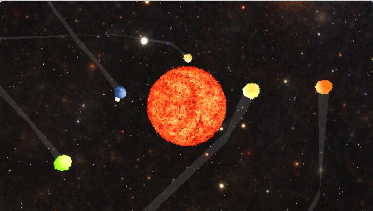
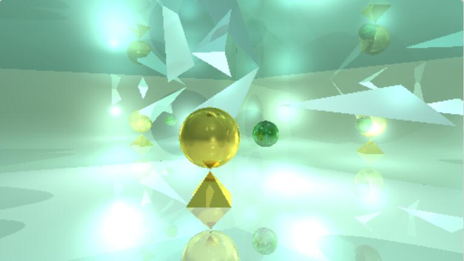
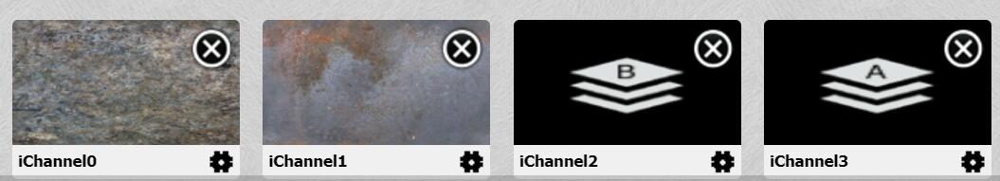
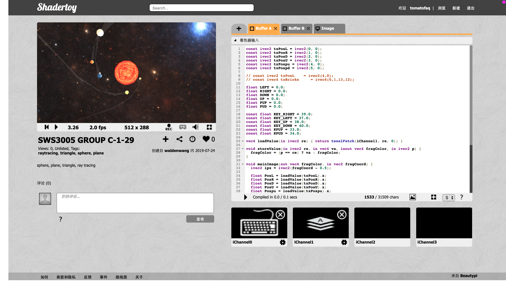
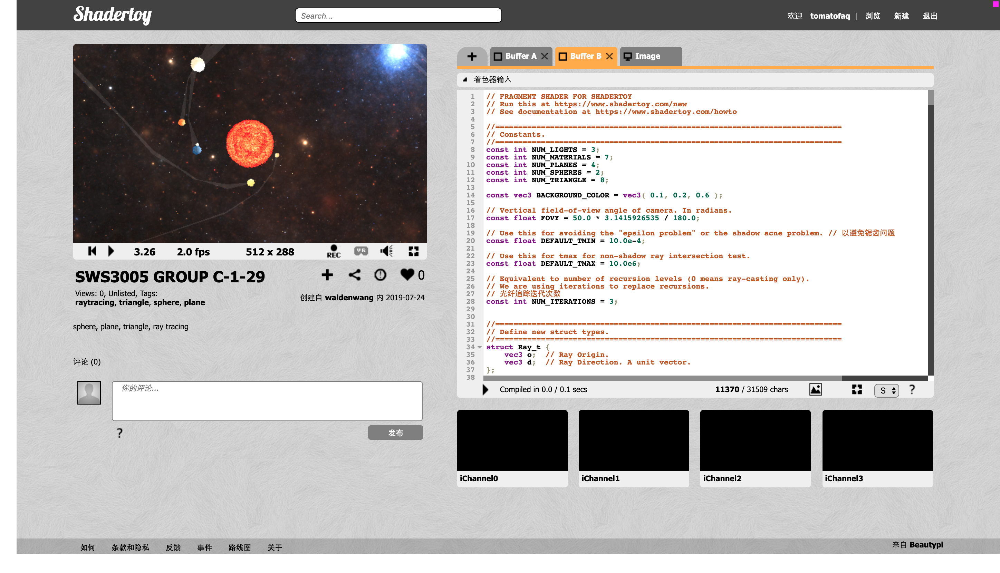
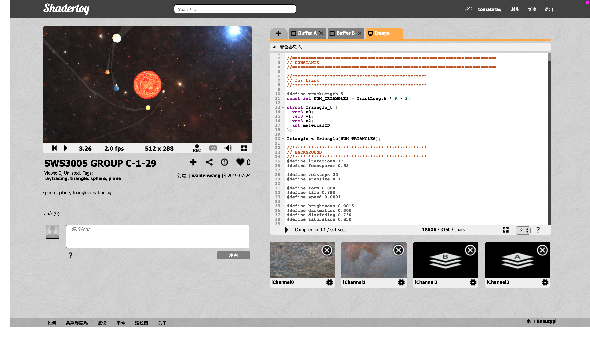

# The Planet

```
// GROUP NUMBER:13
// STUDENT NAME:WU PENGYU
// NUS User ID.: t0918566
// STUDENT NAME: WANG SIYUAN
// NUS User ID.: t0918594
// STUDENT NAME: FAN QIANYI	
// NUS User ID.: t0918683
```
## VIEW


We create a shader to render a solar system. In this shader, we implement a planet class with rusty surface which phone shading supported. We also implement a method to render the trail of each planet.

If you have configure the enviroment right, you will see following scene.

At first, you can see the whole solar system. You can use the direction keys ⬆️⤵️⬅️➡️ to move the position of camera.




After twenty or thirty seconds, the scene will shrink to the sun. You enter a world named Mirror Space. Well, it's just an animation。




That's all.

## CONFIG

Here is the configure procedure.

We create three buffer in shadertoy, named buffer A, buffer B and Image. Each buffer have its own texture configuration.

After pasting the each codes from files to the corresponding buffer, we need to configurate the texture it reads from.
In buffer A, you should select which texture to read in each iChannel. You may configurate iChannel like this.


In buffer B, you needn't change any thing. Just left all the iChannel blank.

In the buffer of image, You may configurate iChannel like this.



So, finally the environment looks like this:







If it doesn't work well, Here is the temp link for the shader.

https://www.shadertoy.com/view/tllSzs